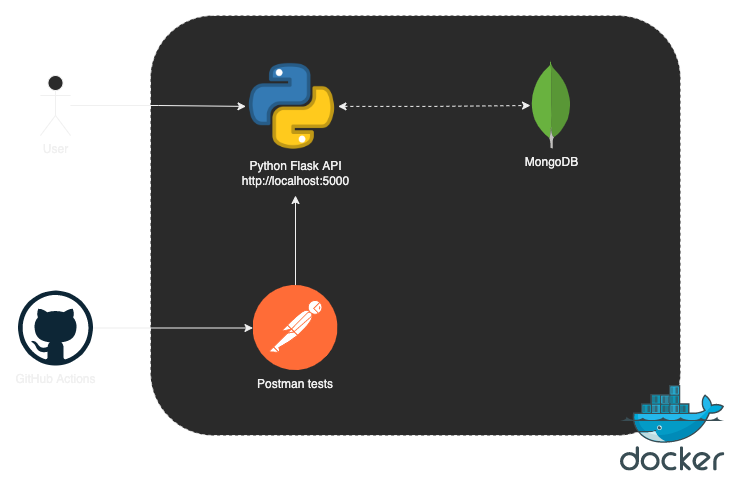
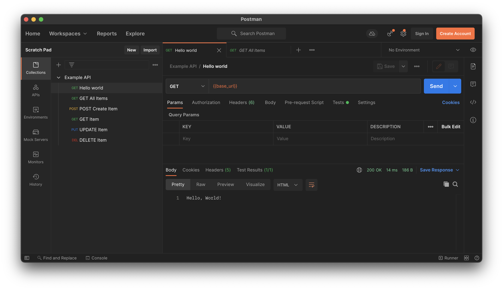

# API Example
Example REST API using Python (Flask), MongoDB and Docker.



## Usage
To build and start the API, run:

```bash
make start
```

Go to http://localhost:5000. You should see a "Hello, World!" message.


## Tests
Postman tests are included for the API endpoints in [tests/Example_API.postman_collection.json](tests/Example_API.postman_collection.json) and are run via GitHub Actions.



They can be run locally using:
```bash
make tests
```